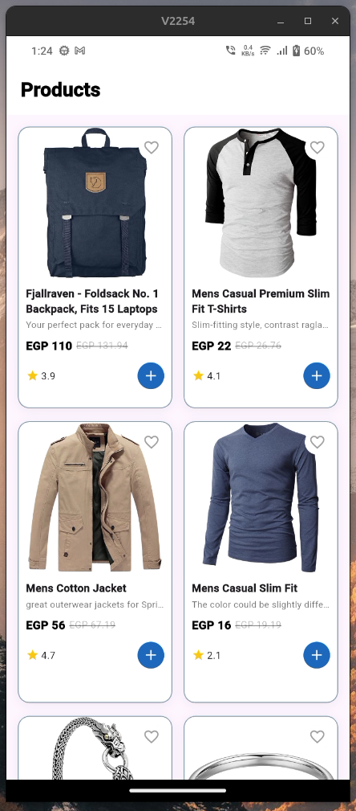
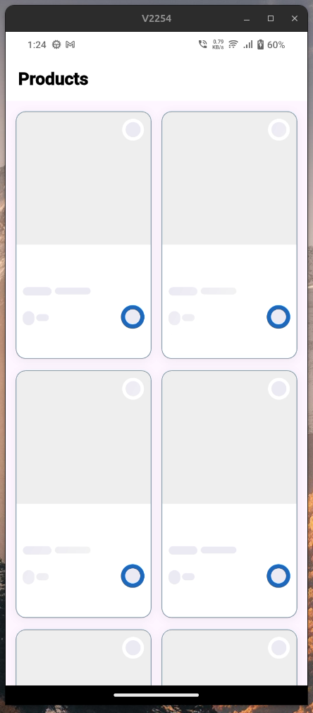

# Products App — Flutter Task

A Flutter application that displays a list of products fetched from the FakeStore API, built with clean architecture and best practices.

## Screenshots

|         Products Grid         |            Loading State            |
| :---------------------------: | :---------------------------------: |
|  |  |

## Architecture

This project follows the **MVVM** pattern and is organized into three layers:

- **Data Layer** — Models, Repository, API Services (Retrofit + Dio)
- **Logic Layer** — Cubit for state management with Freezed sealed states
- **Presentation Layer** — Screens and reusable Widgets

## Tech Stack

| Package                  | Purpose                     |
| ------------------------ | --------------------------- |
| `flutter_bloc` + `cubit` | State Management            |
| `dio` + `retrofit`       | Networking & API calls      |
| `get_it`                 | Dependency Injection        |
| `freezed`                | Sealed States & Union Types |
| `json_serializable`      | JSON Parsing                |
| `cached_network_image`   | Image Loading & Caching     |
| `skeletonizer`           | Skeleton Loading UI         |
| `flutter_screenutil`     | Responsive UI               |
| `pretty_dio_logger`      | Network Request Logging     |

## Project Structure

```
lib/
├── core/
│   ├── di/
│   │   └── dependency_injection.dart   # GetIt setup
│   ├── network/
│   │   ├── api_constants.dart          # Base URL & endpoints
│   │   ├── api_exception.dart          # Error handling
│   │   ├── api_result.dart             # Success/Failure sealed class
│   │   ├── api_services.dart           # Retrofit interface
│   │   └── dio_factory.dart            # Dio singleton
│   └── styles/
│       ├── app_colors.dart
│       └── app_text_styles.dart
└── features/
    └── products/
        ├── data/
        │   ├── models/
        │   │   └── products_model.dart
        │   └── repo/
        │       └── products_repo.dart
        ├── logic/
        │   └── products_cubit/
        │       ├── prodcuts_cubit.dart
        │       └── prodcuts_state.dart
        └── presentation/
            ├── product_screen.dart
            └── widgets/
                ├── product_card.dart
                └── product_screen_body.dart
```

## API

```
GET https://fakestoreapi.com/products
```

## How to Run

```bash
flutter pub get
dart run build_runner build --delete-conflicting-outputs
flutter run
```
